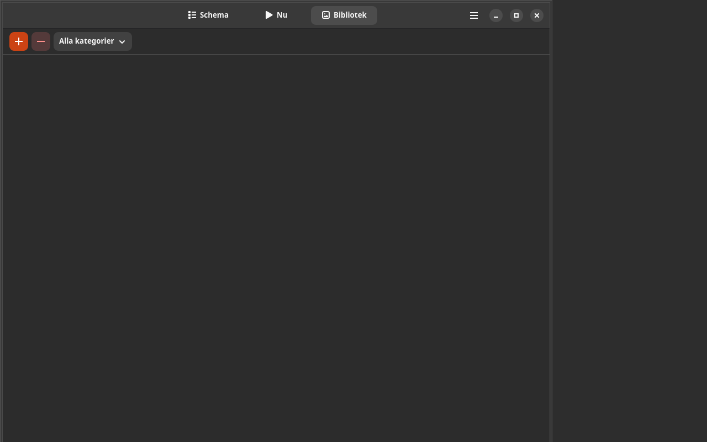

# Bildstöd

[](https://github.com/yeager/bildstod/releases)
[](https://www.gnu.org/licenses/gpl-3.0)
[](https://www.transifex.com/danielnylander/bildstod/)

Visual schedule and picture communication tool with ARASAAC pictogram support — GTK4/Adwaita.

> **For:** Children and adults with autism, developmental language disorder (DLD), ADHD, or intellectual disabilities. Provides visual support through picture schedules, image cards, and ARASAAC pictograms.



## Features

- **Visual schedules** — create daily schedules with images and text
- **ARASAAC pictograms** — search and download from 13,000+ free pictograms
- **Image cards** — customizable cards with text labels and categories
- **Drag & drop** — reorder schedule items easily
- **Categories** — organize images by activity type
- **CSV export** — export schedules with app branding (Ctrl+E)
- **Dark/light theme** — toggle via header bar
- **Keyboard shortcuts** — Ctrl+Q, F5, Ctrl+/

## Installation

### Debian/Ubuntu

```bash
echo "deb [signed-by=/usr/share/keyrings/yeager-keyring.gpg] https://yeager.github.io/debian-repo stable main" | sudo tee /etc/apt/sources.list.d/yeager.list
curl -fsSL https://yeager.github.io/debian-repo/yeager-keyring.gpg | sudo tee /usr/share/keyrings/yeager-keyring.gpg > /dev/null
sudo apt update && sudo apt install bildstod
```

### Fedora/openSUSE

```bash
sudo dnf config-manager --add-repo https://yeager.github.io/rpm-repo/yeager.repo
sudo dnf install bildstod
```

### From source

```bash
git clone https://github.com/yeager/bildstod.git
cd bildstod && pip install -e .
bildstod
```

## ARASAAC Attribution

Pictographic symbols © Gobierno de Aragón, created by Sergio Palao for [ARASAAC](https://arasaac.org), distributed under [CC BY-NC-SA 4.0](https://creativecommons.org/licenses/by-nc-sa/4.0/).

## Translation

Help translate on [Transifex](https://www.transifex.com/danielnylander/bildstod/).

## License

GPL-3.0-or-later — see [LICENSE](LICENSE) for details.

## Author

**Daniel Nylander** — [danielnylander.se](https://danielnylander.se)
