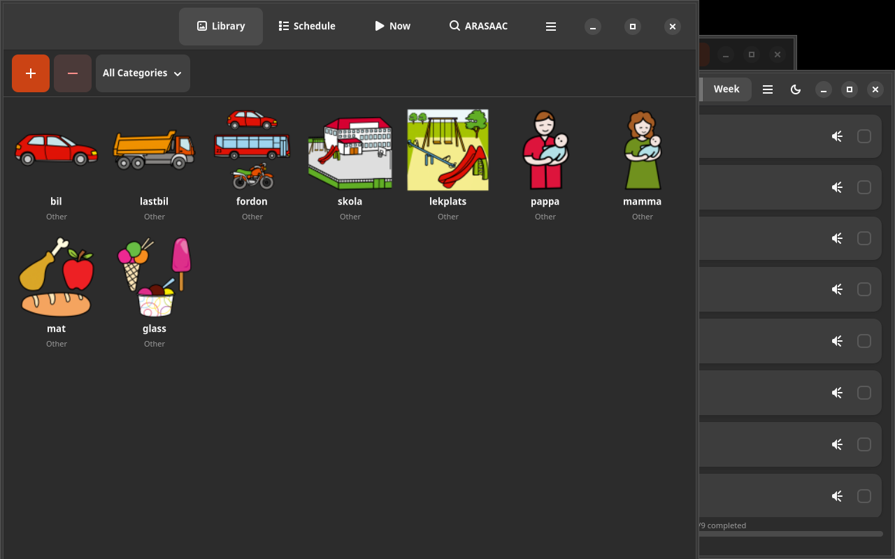

# Bildstöd


## Screenshot



## Description

Visual communication tool with ARASAAC pictogram search and communication boards for children with autism and communication needs. Bildstöd provides an intuitive platform for creating and using visual schedules, communication boards, and picture-based learning materials.

This application is part of the comprehensive autism apps suite, specifically designed to support children with autism, language disorders, and ADHD in their daily communication and learning. Visit [autismappar.se](https://autismappar.se) for more information about the complete suite of accessibility tools.

## Features

- **ARASAAC pictogram search**: Access to thousands of standardized pictograms
- **Communication boards**: Create custom visual communication boards
- **Visual schedules**: Build daily routines and task sequences
- **Drag-and-drop interface**: Easy pictogram arrangement and organization
- **Export capabilities**: Save boards for printing or digital use
- **GTK4/Adwaita interface**: Modern, accessible design
- **Autism-friendly**: Designed with sensory considerations
- **Multilingual support**: Pictograms available in multiple languages
- **Educational tool**: Supports speech therapy and special education

## Installation

### APT (Debian/Ubuntu)
```bash
echo "deb https://yeager.github.io/debian-repo stable main" | sudo tee /etc/apt/sources.list.d/yeager-l10n.list
curl -fsSL https://yeager.github.io/debian-repo/yeager-l10n.gpg | sudo gpg --dearmor -o /etc/apt/trusted.gpg.d/yeager-l10n.gpg
sudo apt update && sudo apt install bildstod
```

### DNF (Fedora)
```bash
sudo dnf config-manager --add-repo https://yeager.github.io/rpm-repo/yeager-l10n.repo
sudo dnf install bildstod
```

### pip
```bash
pip install bildstod
```

## Building from source

```bash
git clone https://github.com/yeager/bildstod
cd bildstod
pip install -e .
```

## Translation

Translations are managed on Transifex: https://app.transifex.com/danielnylander/bildstod/

Currently supported: Swedish, Danish, German, Spanish, Finnish, French, Italian, Norwegian Bokmål, Dutch, Polish, Portuguese (Brazil)

Contributions welcome!

## Changelog

- **0.4.7**: Latest stable release with enhanced pictogram search
- **0.4.x**: Improved communication board functionality
- **0.3.x**: GTK4 port and interface improvements
- **0.2.x**: ARASAAC integration and visual schedule features
- **0.1.x**: Initial development and core functionality

## License

GPL-3.0-or-later

## Author

Daniel Nylander (daniel@danielnylander.se)